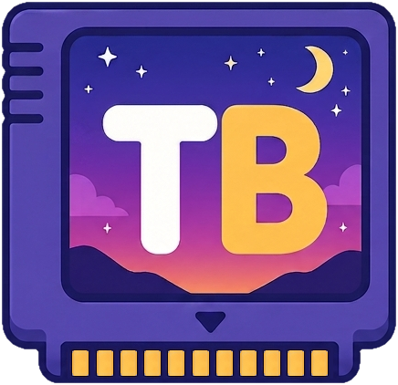
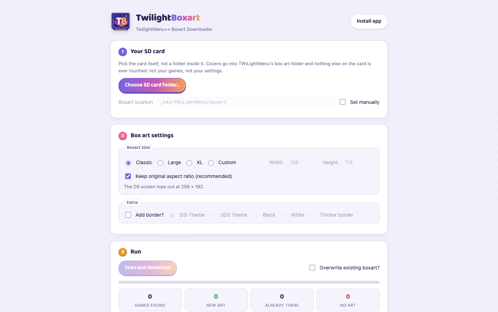
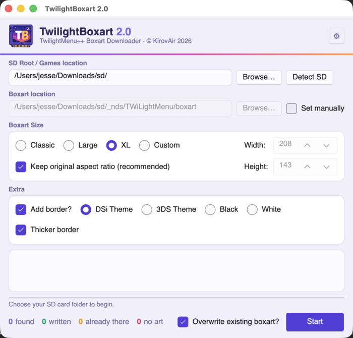
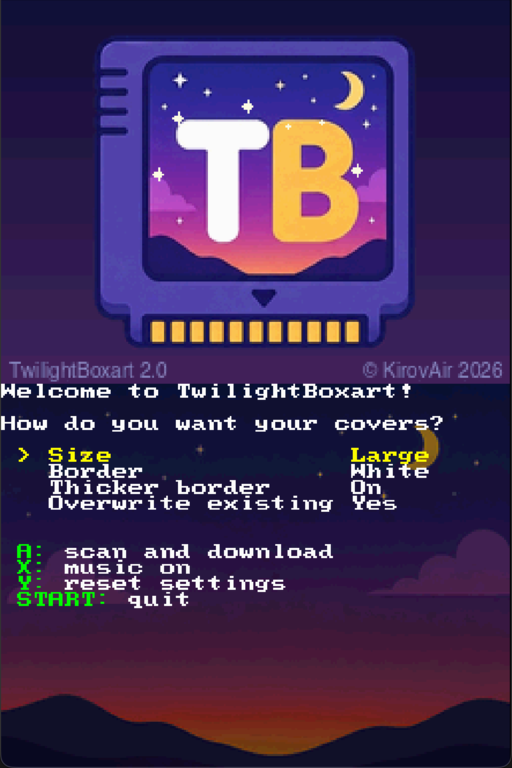

<p align="center">
  
</p>

<h1 align="center">TwilightBoxart 2.0</h1>

<p align="center"><b>Box art for TWiLightMenu++, straight onto your SD card.</b></p>

A boxart downloader that works out what your games actually are and fetches the right covers,
sized so TWiLightMenu++ will definitely show them. Written for
[TWiLightMenu++](https://github.com/DS-Homebrew/TWiLightMenu), and happy to fill a folder for any
other loader too. 😊



## Pick your flavour

| | App | Good for |
| --- | --- | --- |
| 🌐 | **[Browser app](https://boxart.kirovair.com)** | The main way: nothing to install, pick your card, press scan |
| 💻 | **Desktop app** ([Releases](https://github.com/KirovAir/TwilightBoxart/releases)) | Windows, macOS and Linux, one file. Works offline too |
| 🎮 | **DSi homebrew** ([Releases](https://github.com/KirovAir/TwilightBoxart/releases)) | The console fills in its own box art over WiFi |
| 🐳 | **Self-hosted** | `docker compose up -d` and you run the whole thing yourself |

<p align="center">
  
  &nbsp;&nbsp;
  
</p>

<p align="center"><i>The desktop app, and the DSi client on its own.</i></p>

Writing straight onto the card from a browser works in Chrome, Edge, Brave, Opera and Vivaldi on
desktop. Firefox and Safari cannot write to a folder, so there you get the same scan and a `.zip`
to extract onto the card yourself. The full story is on the
[browser support page](TwilightBoxart.Web/wwwroot/support.html).

**Your card is safe.** Every app only ever writes PNG files into `_nds/TWiLightMenu/boxart/` (or a
folder you point it at). Nothing is renamed, moved or deleted, and your games and settings are
never touched.

## Supported systems

Games are identified by what they **contain**, not what they are called: a wrongly named file
still gets the right cover. Matching runs down a ladder, cheapest evidence first.

| System | Matching (in order) |
| --- | --- |
| Nintendo - Nintendo DS | title id / crc32 / sha1 / filename |
| Nintendo - Nintendo DSi | title id / crc32 / sha1 / filename |
| Nintendo - Nintendo DSi (DSiWare) | title id / crc32 / sha1 / filename |
| Nintendo - Game Boy Advance | title id / crc32 / sha1 / filename |
| Nintendo - Game Boy | game code / crc32 / sha1 / filename |
| Nintendo - Game Boy Color | game code / crc32 / sha1 / filename |
| Nintendo - Nintendo 64 *(new in 2.0)* | game code / crc32 / sha1 / filename |
| Nintendo - Nintendo Entertainment System | crc32 / sha1 / filename |
| Nintendo - Super Nintendo Entertainment System | crc32 / sha1 / filename |
| Nintendo - Family Computer Disk System | game code / crc32 / sha1 / filename |
| Sega - Mega Drive - Genesis | serial / crc32 / sha1 / filename |
| Sega - Master System - Mark III | crc32 / sha1 / filename |
| Sega - Game Gear | crc32 / sha1 / filename |
| Sega - SG-1000 *(new in 2.0)* | crc32 / sha1 / filename |
| NEC - PC Engine - TurboGrafx 16 *(new in 2.0)* | crc32 / sha1 / filename |
| Bandai - WonderSwan *(new in 2.0)* | crc32 / sha1 / filename |
| Bandai - WonderSwan Color *(new in 2.0)* | crc32 / sha1 / filename |
| SNK - Neo Geo Pocket *(new in 2.0)* | crc32 / sha1 / filename |
| SNK - Neo Geo Pocket Color *(new in 2.0)* | crc32 / sha1 / filename |
| Atari - 2600 *(new in 2.0)* | crc32 / sha1 / filename |
| Atari - 5200 *(new in 2.0)* | crc32 / sha1 / filename |
| Atari - 7800 *(new in 2.0)* | crc32 / sha1 / filename |
| Coleco - ColecoVision *(new in 2.0)* | crc32 / sha1 / filename |
| Mattel - Intellivision *(new in 2.0)* | crc32 / sha1 / filename |
| Microsoft - MSX *(new in 2.0)* | crc32 / sha1 / filename |
| Microsoft - MSX2 *(new in 2.0)* | crc32 / sha1 / filename |
| Nintendo - Pokemon Mini *(new in 2.0)* | crc32 / sha1 / filename |

That is every console TWiLightMenu++ emulates that both [No-Intro](https://no-intro.org) and
[libretro-thumbnails](https://github.com/libretro-thumbnails) have data for. It takes both: one
names the dump, the other has the cover. The menu also lists `.xex`/`.atr` (Atari 8-bit), `.m5`
(Sord M5) and `.dsk` (Amstrad CPC), which are left out on purpose. Nothing publishes box art for
them, so every lookup would miss.

File extensions follow TWiLightMenu++'s own list, so anything the menu will launch is something
this will scan. That includes `.agb`/`.mb` for GBA and `.srl`/`.ids`/`.app` for DS(i).

Some nice tricks along the way:

* Title ids and game codes are read straight out of the ROM header: free and exact.
* `.zip` **and `.7z`** *(new in 2.0)* archives are scanned **without decompressing**: the checksum
  of the game inside is already in the archive's own header, so an 18,000-game card scans in
  minutes, a few hundred bytes per file.
* N64 games are matched whatever their byte order (`.z64` / `.v64` / `.n64`).
* Whatever still misses gets a list telling you exactly what it was recognised as and why there
  was no cover. Never a silent skip.

## Boxart sources

* [GameTDB](https://www.gametdb.com) by title id matching.
* [libretro-thumbnails](https://github.com/libretro-thumbnails) by
  [No-Intro](https://no-intro.org) name matching.
* Every cover is delivered under TWiLightMenu++'s box art size limit, so nothing silently refuses
  to show up on the console.

## Self-hosting

One container, one volume, no database server, no preparation:

```bash
docker compose up -d      # then open http://localhost:8186
```

On first boot the server downloads the public No-Intro data and builds its own game index in the
background, serving all the while. Set an admin password and `/admin.html` gives you instance
stats and an "update No-Intro index" button for whenever the database should catch up.
Configuration is documented inline in [docker-compose.yml](docker-compose.yml); the backend's own
[README](TwilightBoxart.Web/README.md) covers the API.

## License

GPL-3.0. See [LICENSE.md](LICENSE.md). The DSi client ships with
[Mbed TLS](https://github.com/Mbed-TLS/mbedtls) (Apache-2.0/GPL-2.0) and a patched
[dswifi](https://codeberg.org/blocksds/dswifi) (MIT), built with
[BlocksDS](https://blocksds.skylyrac.net/); their notices are in
[THIRD-PARTY-NOTICES.md](THIRD-PARTY-NOTICES.md).

## Credits

Covers come from [GameTDB](https://www.gametdb.com) and
[libretro-thumbnails](https://github.com/libretro-thumbnails); identification data from
[No-Intro](https://no-intro.org) via the [libretro-database](https://github.com/libretro/libretro-database)
mirror. Built for [TWiLightMenu++](https://github.com/DS-Homebrew/TWiLightMenu).
Music on the DSi client: "Pixel Cart Drift" by Jesse Sander.

## Legal

TwilightBoxart is a fan-made, open-source tool and is not affiliated with, endorsed by or
sponsored by Nintendo. It distributes no games and contains none: it reads files already on your
card to identify them, and writes cover images, nothing else. Covers are fetched from the
community databases credited above; identification data is factual metadata (names, serials,
checksums). If you hold rights to something served by this project and want it removed, open a
GitHub issue and it will be handled promptly.

## Development

```
TwilightBoxart.Web         The API server and the web app it serves
TwilightBoxart.Pipeline    Art fetching, caching and eviction
TwilightBoxart.Data        EF Core + SQLite records
TwilightBoxart.Core        Identification, header parsers, index building, rendering, art sources
TwilightBoxart.Desktop     Desktop app (Avalonia)
TwilightBoxart.DSi         DSi homebrew client (BlocksDS)
TwilightBoxart.Tests       MSTest suite
```

`dotnet run --project TwilightBoxart.Web` starts everything on port 8186.
