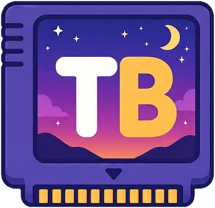
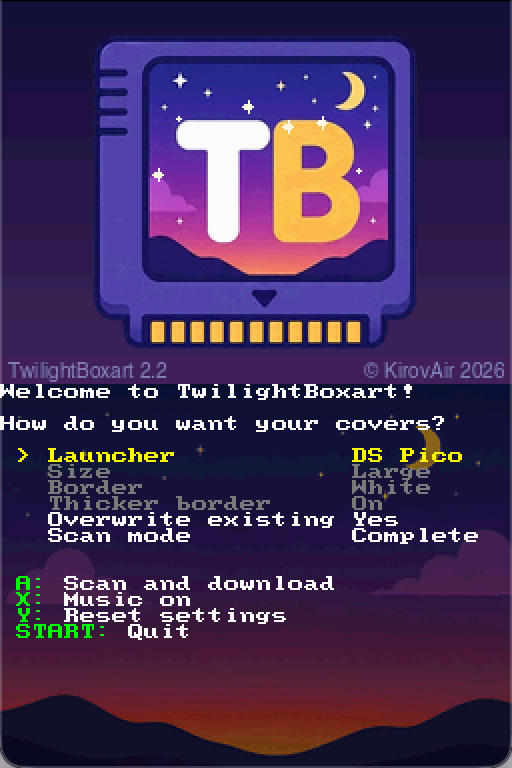
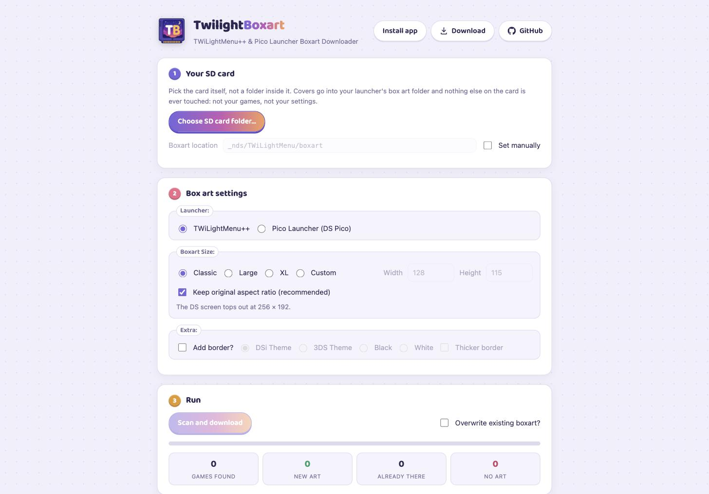
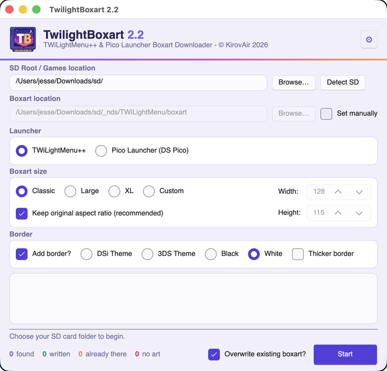

<p align="center">
  
</p>

<h1 align="center">TwilightBoxart</h1>

<p align="center">Box art for <a href="https://github.com/DS-Homebrew/TWiLightMenu"><b>TWiLightMenu++</b></a> and <a href="https://github.com/LNH-team/pico-launcher"><b>Pico Launcher</b></a>, straight onto your SD card.</p>

<p align="center">
  <a href="https://github.com/KirovAir/TwilightBoxart/releases"></a>
  <a href="https://github.com/KirovAir/TwilightBoxart/releases"></a>
  <a href="https://github.com/KirovAir/TwilightBoxart/stargazers"></a>
  <a href="LICENSE.md"></a>
</p>

<h3 align="center"><a href="https://twilightboxart.com/">→ Open the web app ←</a></h3>
<p align="center">Plug the card in, press scan.</p>

TwilightBoxart does one thing and does it properly. It works out what your games actually are and
grabs the right covers in the shape your launcher wants. Covers almost every console a DS can play,
27 of them. Runs in your browser, as a desktop app, or as homebrew on the DS itself. 😊

## 👾 DS / DSi version

Hate connecting your SD card to a computer? No problem. Copy the `.nds` to your card, launch it, and
the console joins your WiFi and fills its own boxart folder. Works on a DSi, and on a DS or DS Lite
with a flashcart.

Reads each game's header, so badly named roms still match. Out of the box it picks the launcher from
what is on the card and skips games that already have a cover, but that is just the default: launcher,
shape, size, border, overwrite and scan mode are all in the options menu.

[Releases](https://github.com/KirovAir/TwilightBoxart/releases)

<p align="center">
  
</p>

## 🌐 Web version

[twilightboxart.com](https://twilightboxart.com/) scans the card and writes the covers straight onto
it, no upload and no install.

<p align="center">
  
</p>

## 💻 Desktop version

Windows, macOS and Linux. Works offline: it builds its own game database when it cannot reach a
backend. [Releases](https://github.com/KirovAir/TwilightBoxart/releases)

<p align="center">
  
</p>

## 🚀 Supported launchers

Every app asks which launcher up front.

| Launcher | Format | Where it goes |
| --- | --- | --- |
| [TWiLightMenu++](https://github.com/DS-Homebrew/TWiLightMenu) | PNG, sized to the menu's limits | `_nds/TWiLightMenu/boxart/<rom name>.png` |
| [Pico Launcher](https://github.com/LNH-team/pico-launcher) (DS Pico) | 8-bit BMP, 128 × 96 | `_pico/covers/user/<rom name>.bmp` |

Pico covers go in the filename-keyed `user` folder: it works for every system below, where the
game-code folders only do NDS and GBA.

Only cover images are written, into the boxart folder. Nothing else on the card is touched.

## 🕹️ Supported systems

Games are identified by what they **contain**, not what they are called. Rename a rom to
`aaaa.gba` and it still gets the right cover.

<details>
<summary><b>All 27 systems, and how each one is matched</b></summary>

| System | Matching (in order) |
| --- | --- |
| Nintendo - Nintendo DS | title id / crc32 / sha1 / filename |
| Nintendo - Nintendo DSi | title id / crc32 / sha1 / filename |
| Nintendo - Nintendo DSi (DSiWare) | title id / crc32 / sha1 / filename |
| Nintendo - Game Boy Advance | title id / crc32 / sha1 / filename |
| Nintendo - Game Boy | game code / crc32 / sha1 / filename |
| Nintendo - Game Boy Color | game code / crc32 / sha1 / filename |
| Nintendo - Nintendo 64 *(new in 2.0)* | game code / crc32 / sha1 / filename |
| Nintendo - Nintendo Entertainment System | crc32 / sha1 / filename |
| Nintendo - Super Nintendo Entertainment System | crc32 / sha1 / filename |
| Nintendo - Family Computer Disk System | game code / crc32 / sha1 / filename |
| Sega - Mega Drive - Genesis | serial / crc32 / sha1 / filename |
| Sega - Master System - Mark III | crc32 / sha1 / filename |
| Sega - Game Gear | crc32 / sha1 / filename |
| Sega - SG-1000 *(new in 2.0)* | crc32 / sha1 / filename |
| NEC - PC Engine - TurboGrafx 16 *(new in 2.0)* | crc32 / sha1 / filename |
| Bandai - WonderSwan *(new in 2.0)* | crc32 / sha1 / filename |
| Bandai - WonderSwan Color *(new in 2.0)* | crc32 / sha1 / filename |
| SNK - Neo Geo Pocket *(new in 2.0)* | crc32 / sha1 / filename |
| SNK - Neo Geo Pocket Color *(new in 2.0)* | crc32 / sha1 / filename |
| Atari - 2600 *(new in 2.0)* | crc32 / sha1 / filename |
| Atari - 5200 *(new in 2.0)* | crc32 / sha1 / filename |
| Atari - 7800 *(new in 2.0)* | crc32 / sha1 / filename |
| Coleco - ColecoVision *(new in 2.0)* | crc32 / sha1 / filename |
| Mattel - Intellivision *(new in 2.0)* | crc32 / sha1 / filename |
| Microsoft - MSX *(new in 2.0)* | crc32 / sha1 / filename |
| Microsoft - MSX2 *(new in 2.0)* | crc32 / sha1 / filename |
| Nintendo - Pokemon Mini *(new in 2.0)* | crc32 / sha1 / filename |

That is every console TWiLightMenu++ emulates that both [No-Intro](https://no-intro.org) and
[libretro-thumbnails](https://github.com/libretro-thumbnails) have data for. It takes both: one
names the dump, the other has the cover. The menu also lists `.xex`/`.atr` (Atari 8-bit), `.m5`
(Sord M5) and `.dsk` (Amstrad CPC), which are left out on purpose. Nothing publishes box art for
them, so every lookup would miss.

File extensions follow TWiLightMenu++'s own list, so anything the menu will launch is something
this will scan. That includes `.agb`/`.mb` for GBA and `.srl`/`.ids`/`.app` for DS(i).

</details>

A lot of work went into the matching. It rarely misses.

## 🖼️ Boxart sources

* [GameTDB](https://www.gametdb.com) by title id matching.
* [libretro-thumbnails](https://github.com/libretro-thumbnails) by
  [No-Intro](https://no-intro.org) name matching.
* Every TWiLightMenu++ cover is delivered under the menu's box art size limit, so nothing silently
  refuses to show up on the console. Pico covers come pre-converted to the launcher's own 8-bit
  BMP format, no separate converter needed.

## 🐳 Self-hosting

One container, one volume, no database server, no preparation:

```bash
docker compose up -d      # then open http://localhost:8186
```

On first boot the server downloads the public No-Intro data and builds its own game index in the
background, serving all the while. Set an admin password and `/admin.html` gives you instance
stats and an "update No-Intro index" button for whenever the database should catch up.
Configuration is documented inline in [docker-compose.yml](docker-compose.yml); the backend's own
[README](TwilightBoxart.Web/README.md) covers the API.

## License

GPL-3.0. See [LICENSE.md](LICENSE.md). The DS/DSi client ships with
[Mbed TLS](https://github.com/Mbed-TLS/mbedtls) (Apache-2.0/GPL-2.0) and a patched
[dswifi](https://codeberg.org/blocksds/dswifi) (MIT), built with
[BlocksDS](https://blocksds.skylyrac.net/); their notices are in
[THIRD-PARTY-NOTICES.md](THIRD-PARTY-NOTICES.md).

## Credits

Covers come from [GameTDB](https://www.gametdb.com) and
[libretro-thumbnails](https://github.com/libretro-thumbnails); identification data from
[No-Intro](https://no-intro.org) via the [libretro-database](https://github.com/libretro/libretro-database)
mirror. Built for [TWiLightMenu++](https://github.com/DS-Homebrew/TWiLightMenu) and
[Pico Launcher](https://github.com/LNH-team/pico-launcher) by
[LNH-team](https://github.com/LNH-team).
Music on the DS/DSi client: "Pixel Cart Drift" by Jesse Sander.

## Legal

TwilightBoxart is a fan-made, open-source tool and is not affiliated with, endorsed by or
sponsored by Nintendo. It distributes no games and contains none: it reads files already on your
card to identify them, and writes cover images, nothing else. Covers are fetched from the
community databases credited above; identification data is factual metadata (names, serials,
checksums). If you hold rights to something served by this project and want it removed, open a
GitHub issue and it will be handled promptly.

## Development

```
TwilightBoxart.Web         The API server and the web app it serves
TwilightBoxart.Pipeline    Art fetching, caching and eviction
TwilightBoxart.Data        EF Core + SQLite records
TwilightBoxart.Core        Identification, header parsers, index building, rendering, art sources
TwilightBoxart.Desktop     Desktop app (Avalonia)
TwilightBoxart.DSi         DS/DSi homebrew client (BlocksDS)
TwilightBoxart.Tests       MSTest suite
```

`dotnet run --project TwilightBoxart.Web` starts everything on port 8186.
